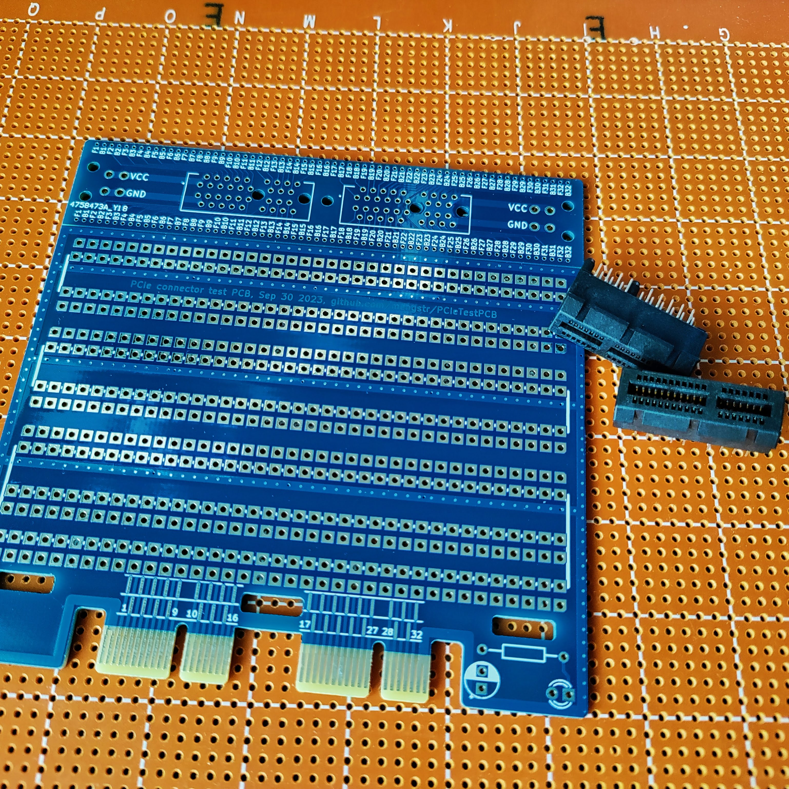
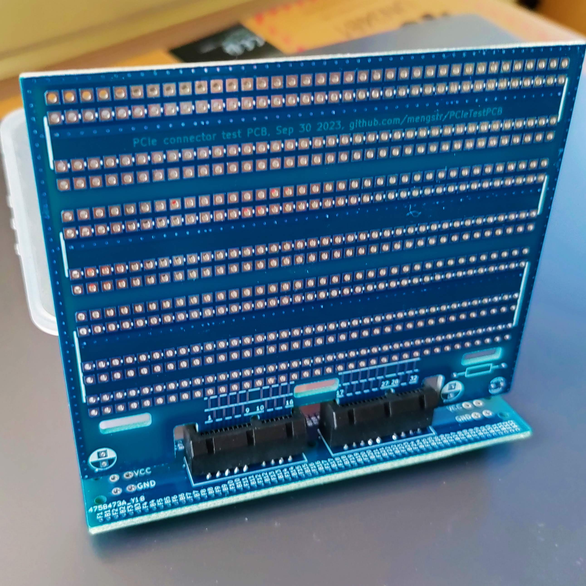
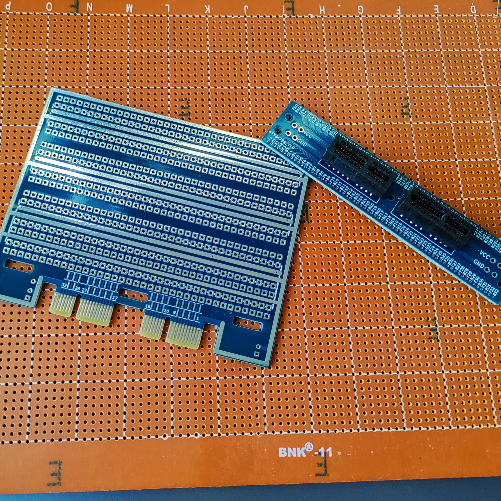

# PCIeTestPCB

A simple PCB to test the 30 cent PCIe connectors from Mouser (SKU 649-1001878410200TLF). The PCB should be 1.6 mm to fit the connector.\

The PCB is meant to be split into two parts. The bottom part have the edgeconnector and a small DIP prototype area. The top parts holds the PCIe connectors and all five of them should be chained together into a backplane using wires going to card to card forming a bus.

This is a bit tedious, but for a quick test it's fine for me. If/when I will use PCIe connectors in a real project I definitely will make a proper backplane where all connectors are placed on the same PCB. But I didn;t want to spend good money for a test board. :-)

